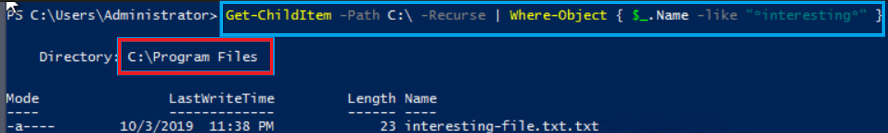
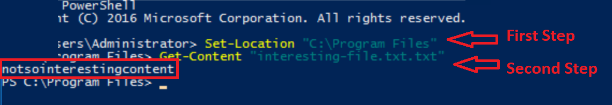
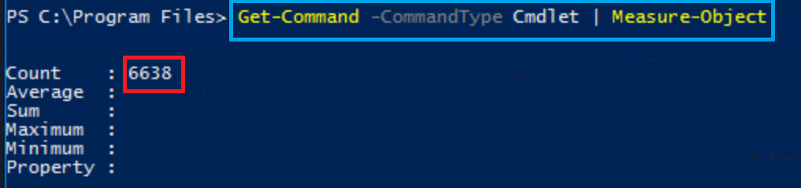
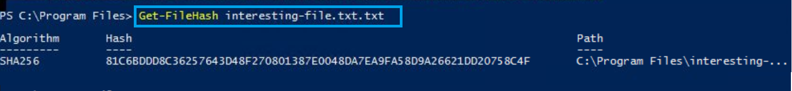
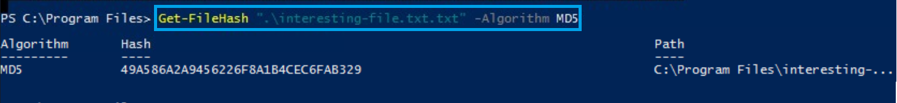
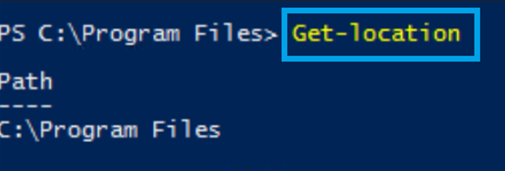
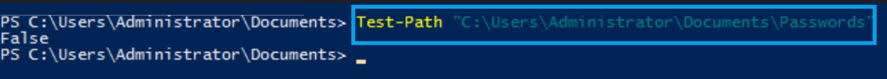
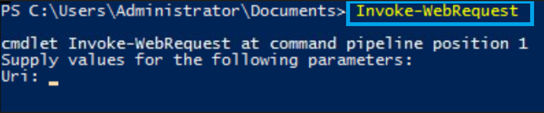

# 📄 Hacking with Powershell - Answers to questions and a description of basic commands

---

## 🧠 SUMMARY

This article describes the basic commands used in the Powershell shell and solves exercises from the TryHackMe - Hacking with Powershell course.


## 🔎 PowerShell - What is it? - the most important informations

**PowerShell** is a command-line shell and scripting language developed by Microsoft, used for automating tasks, system administration, and environment configuration, primarily on Microsoft Windows.

**Key Information**

PowerShell is used for:

- administering Microsoft Windows systems

- automating tasks (e.g., installations, configurations)

- managing files and folders

- managing servers and networks

- writing administrative scripts


**PowerShell** runs in a terminal, similar to:

- Command Prompt (CMD)

- Linux Bash

But it is **more advanced**.

## 💡 The Most Important PowerShell Commands

1. **Get-Help**

- Displays documentation and usage information for PowerShell commands.

Example:

*Get-Help Get-Process*

This command shows instructions and details about how the Get-Process command works.

2. **Get-Command**

- Lists available commands in PowerShell.

Example:

*Get-Command*

It displays all commands that can be executed in the current PowerShell environment.

3. **Get-Process**

- Shows all processes that are currently running on the system.

Example:

*Get-Process*

This command provides information about active programs and background processes.

4. **Get-Service**

- Displays services installed on the system and their current status.

Example:

*Get-Service*

It allows administrators to check whether services are running or stopped.

5. **Get-ChildItem**

- Lists files and directories in a specified location.

Example:

Get-ChildItem

This command shows the contents of the current directory, similar to dir or ls.

6. **Set-Location**

- Changes the current working directory.

Example:

*Set-Location C:\Users*

It moves the user to the specified folder.

7. **Copy-Item**

- Copies files or directories from one location to another.

Example:

*Copy-Item file.txt C:\Backup*

This command creates a copy of file.txt in the Backup folder.

8. **Remove-Item**

- Deletes files or directories.

Example:

*Remove-Item file.txt*

It permanently removes the specified file.

9. **New-Item**

- Creates new files or folders.

Example:

*New-Item test.txt*

This command creates a new file called test.txt.

10. **Stop-Process**

- Terminates a running process.

Example:

*Stop-Process -Name notepad*

This command stops the Notepad application if it is currently running.


## 🔥 **Answers the guestions**:

1. What is the location of the file "interesting-file.txt"

</p>
<p align="center">
  
  <br>
  <em>Figure 1: Answer 1 - Path_to_file</em>
</p>

2. Specify the contents of this file

</p>
<p align="center">
  
  <br>
  <em>Figure 2: Answer 2 - Get_Content</em>
</p>
3. How many cmdlets are installed on the system(only cmdlets, not functions and aliases)?
   
</p>
<p align="center">
  
  <br>
  <em>Figure 3: Answer 3 - Get-Command_cmdlets</em>
</p>
4. Get the MD5 hash of interesting-file.txt

</p>
<p align="center">
  
  <br>
  <em>Figure 4: Answer 4 - SHA256_Hash</em>
</p>

</p>
<p align="center">
  
  <br>
  <em>Figure 5: Answer 4 - MD5_Hash</em>
</p>

5. What is the command to get the current working directory?

</p>
<p align="center">
  
  <br>
  <em>Figure 6: Answer 5 - Get-location</em>
</p>

6. Does the path "C:\Users\Administrator\Documents\Passwords" Exist (Y/N)?
   
</p>
<p align="center">
  
  <br>
  <em>Figure 7: Answer 6 - Test-Path</em>
</p>

7. What command would you use to make a request to a web server?

</p>
<p align="center">
  
  <br>
  <em>Figure 8: Answer 7 - Invoke-WebRequest</em>
</p>

8. Base64 decode the file b64.txt on Windows.
   
</p>
<p align="center">
  
  <br>
  <em>Figure 8: Answer 8 - Path to 64</em>
</p>

</p>
<p align="center">
  
  <br>
  <em>Figure 9: Answer 7 - Decode_file</em>
</p>

## 📸 Information and photos from the analysis of the Incident:


                          | Value                            | Comment                                    | Type           |
                          | ---------------------------------| ------------------------------------------ | -------------- |
                          | 33[.]33[.]33[.]33                | Destination IP Address                     | IP Address     |  
                          | 37[.]19[.]221[.]229              | Malicious IP address                       | IP Address     |
                          | 172[.]16[.]17[.]210              | Victim's IP address - Mane                 | IP Address     |
                          | mane@letsdefend[.]io             | Compromised credential - Email Address     | Email Address  | 
</p>


The final results after the case was closed:
</p>
<p align="center">
  
  <br>
  <em>Figure 9: Results_of_my_research</em>
</p>


**The Summary of the investigation**:


## 📂 Project Structure

```bash


```


