# 📄 Hacking with Powershell - Answers to questions about Enumeration

---

## 🧠 SUMMARY

This article describes the basic commands used in the Powershell shell and solves exercises from the TryHackMe - Hacking with Powershell course.

In conclusion, **PowerShell** is a very important tool in modern IT environments. Its flexibility, scripting capabilities, and integration with system components make it a valuable resource for system administrators, DevOps engineers, and cybersecurity professionals. The completed tasks helped build practical skills and a deeper understanding of how PowerShell can be used in real-world situations.

## 🔎 PowerShell - What is it? - the most important informations

**PowerShell** is a command-line shell and scripting language developed by Microsoft, used for automating tasks, system administration, and environment configuration, primarily on Microsoft Windows.

**Key Information**

PowerShell is used for:

- administering Microsoft Windows systems

- automating tasks (e.g., installations, configurations)

- managing files and folders

- managing servers and networks

- writing administrative scripts


**PowerShell** runs in a terminal, similar to:

- Command Prompt (CMD)

- Linux Bash

But it is **more advanced**.

## 💡 The Most Important PowerShell Commands

1. **Get-Help**

- Displays documentation and usage information for PowerShell commands.

Example:

*Get-Help Get-Process*

This command shows instructions and details about how the Get-Process command works.

2. **Get-Command**

- Lists available commands in PowerShell.

Example:

*Get-Command*

It displays all commands that can be executed in the current PowerShell environment.

3. **Get-Process**

- Shows all processes that are currently running on the system.

Example:

*Get-Process*

This command provides information about active programs and background processes.

4. **Get-Service**

- Displays services installed on the system and their current status.

Example:

*Get-Service*

It allows administrators to check whether services are running or stopped.

5. **Get-ChildItem**

- Lists files and directories in a specified location.

Example:

Get-ChildItem

This command shows the contents of the current directory, similar to dir or ls.

6. **Set-Location**

- Changes the current working directory.

Example:

*Set-Location C:\Users*

It moves the user to the specified folder.

7. **Copy-Item**

- Copies files or directories from one location to another.

Example:

*Copy-Item file.txt C:\Backup*

This command creates a copy of file.txt in the Backup folder.

8. **Remove-Item**

- Deletes files or directories.

Example:

*Remove-Item file.txt*

It permanently removes the specified file.

9. **New-Item**

- Creates new files or folders.

Example:

*New-Item test.txt*

This command creates a new file called test.txt.

10. **Stop-Process**

- Terminates a running process.

Example:

*Stop-Process -Name notepad*

This command stops the Notepad application if it is currently running.


## 🔥 **Answers the guestions**:

The first step when you have gained initial access to any machine would be to enumerate. We'll be enumerating the following:

- users
- basic networking information
- file permissions
- registry permissions
- scheduled and running tasks
- insecure files

1. How many users are there on the machine?

</p>
<p align="center">
  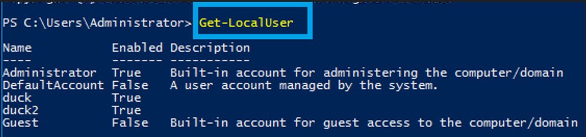
  <br>
  <em>Figure 1: Answer 1 - Get-LocalUser</em>
</p>

2. Which local user does this SID(S-1-5-21-1394777289-3961777894-1791813945-501) belong to?

</p>
<p align="center">
  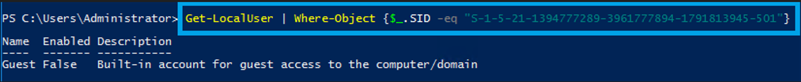
  <br>
  <em>Figure 2: Answer 2 - Guest-SID</em>
</p>

3. How many users have their password required values set to False?
   
</p>
<p align="center">
  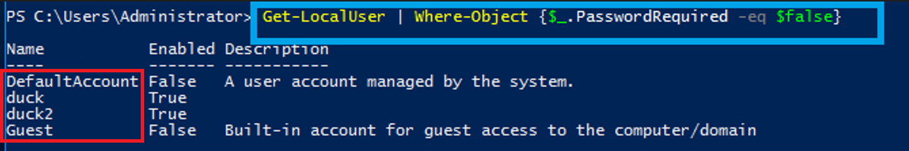
  <br>
  <em>Figure 3: Answer 3 - Password_required_values</em>
</p>

4. How many local groups exist?

</p>
<p align="center">
  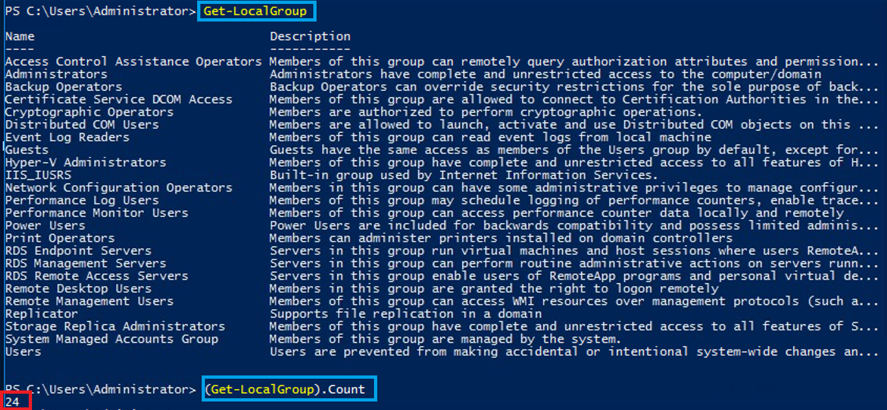
  <br>
  <em>Figure 4: Answer 4 - Local_Groups</em>
</p>

5. What command did you use to get the IP address info?

</p>
<p align="center">
  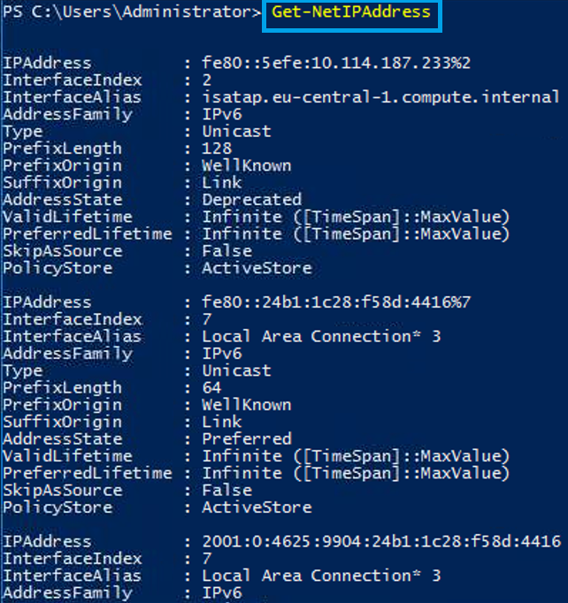
  <br>
  <em>Figure 5: Answer 5 - IP_Address_info</em>
</p>

6. How many ports are listed as listening?

</p>
<p align="center">
  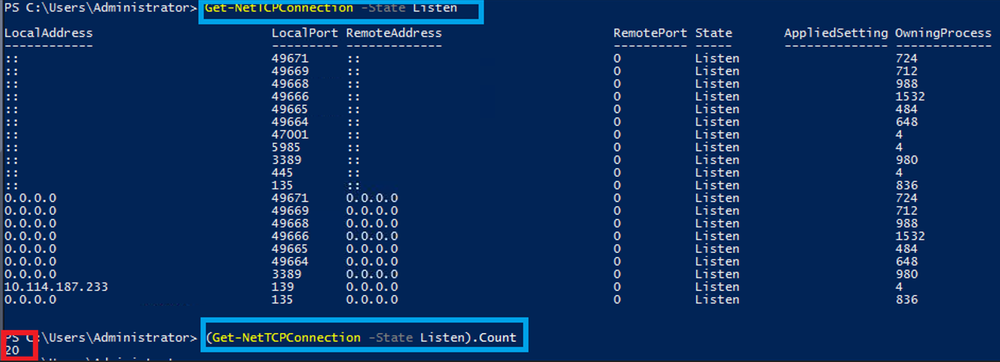
  <br>
  <em>Figure 6: Answer 6 - Listening_ports</em>
</p>

7. What is the remote address of the local port listening on port 445?
   
</p>
<p align="center">
  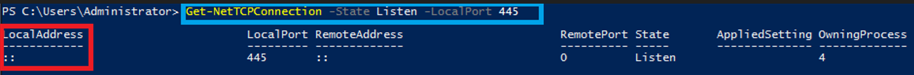
  <br>
  <em>Figure 7: Answer 7 - Local_port_445</em>
</p>

8. How many patches have been applied?

</p>
<p align="center">
  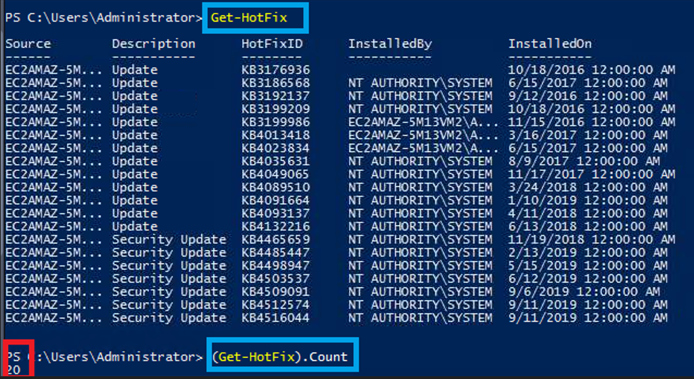
  <br>
  <em>Figure 8: Answer 8 - Get-HotFix</em>
</p>

9. When was the patch with ID KB4023834 installed?

</p>
<p align="center">
  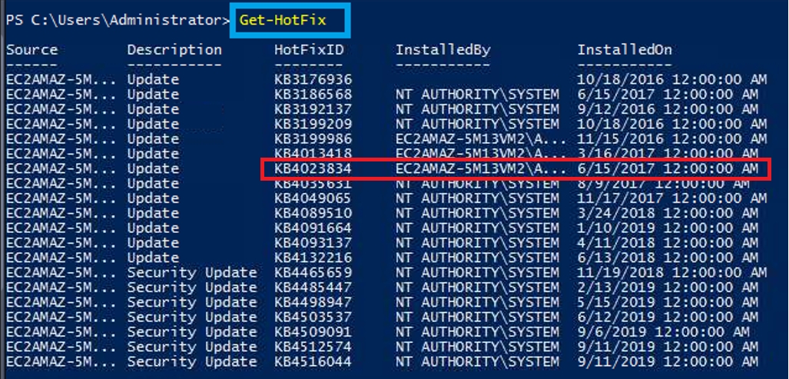
  <br>
  <em>Figure 9: Answer 9 - Patch_ID_KB4023834</em>
</p>

10. Find the contents of a backup file.

</p>
<p align="center">
  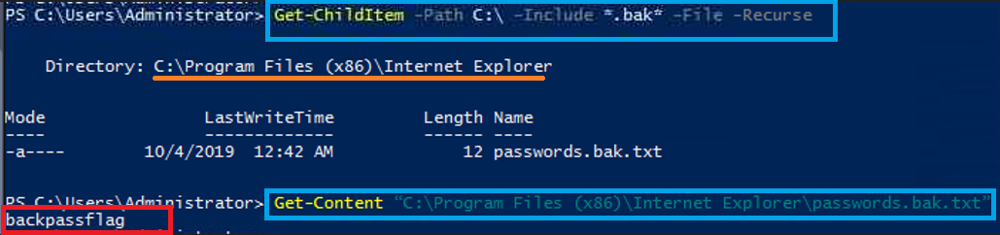
  <br>
  <em>Figure 10: Answer 10 - Backup_file</em>
</p>

11. Search for all files containing API_KEY

</p>
<p align="center">
  
  <br>
  <em>Figure 11: Answer 11 - FIles_API_KEY</em>
</p>


12. What command do you do to list all the running processes?

</p>
<p align="center">
  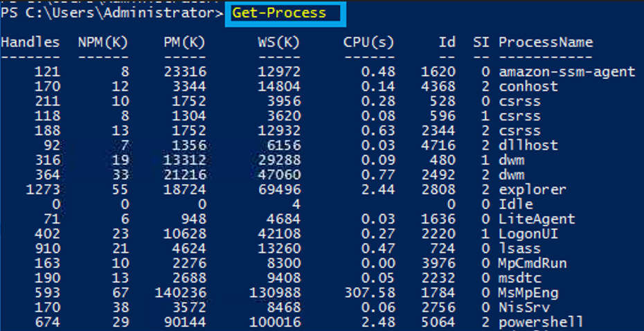
  <br>
  <em>Figure 12: Answer 12 - Get-Proces</em>
</p>

13. What is the path of the scheduled task called new-sched-task?

</p>
<p align="center">
  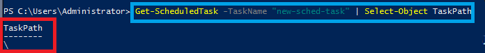
  <br>
  <em>Figure 13: Answer 13 - new-sched-task</em>
</p>

14. Who is the owner of the C:\

</p>
<p align="center">
  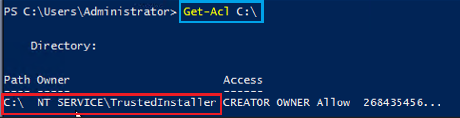
  <br>
  <em>Figure 14: Answer 14 - Get-Acl</em>
</p>

**The Summary of the investigation**:

This report presents answers and solutions related to tasks from the Hacking with PowerShell course. The main goal of the work was to understand the basic concepts of using PowerShell and to practice the most important commands used in system administration and cybersecurity.

During the exercises, various PowerShell commands were used to explore system processes, services, files, and directories. The tasks also demonstrated how PowerShell can be applied in practical scenarios related to system management and security analysis.


Working with these exercises helped develop a better understanding of how command-line tools operate and how automation can simplify complex administrative tasks. 

## 📂 Project Structure

```bash
PowerShell_Exercise_2
│
├── 00_README
│   └── README.md
│
├── 01_Ans_1
│   └── Get-LocalUser.png
│
├── 02_Ans_2
│   └── Guest-SID.png
│
├── 03_Ans_3
│   └── Password_required_values.png
│
├── 04_Ans_4
│   └── Local_Groups.png
│
├── 05_Ans_5
│   └── IP_Address_info.png
│
├── 06_Ans_6
│   └── Listening_ports.png
│
├── 07_Ans_7
│   └── Local_port_445.png
│
├── 08_Ans_8
│   └── Get-HotFix.png
│
├── 09_Ans_9
│   └── Patch_ID_KB4023834.png
│
├── 10_Ans_10
│   └── Backup_file.png
│
├── 11_Ans_11
│   └── Files_API_KEY.png
│
├── 12_Ans_12
│   └── Get-Process.png
│
├── 13_Ans_13
│   └── new-sched-task.png
│
└── 14_Ans_14
    └── Get-Acl.png


```


